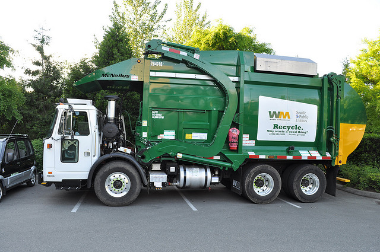

!SLIDE center
# GC optimizations

!SLIDE bullets
# Ruby's GC

* conservative
* stop the world
* mark-and-sweep

!SLIDE
# Twitter's configuration

    @@@ ruby
    RUBY_HEAP_MIN_SLOTS=500000
    # Initial number of heap slots. (10000)

    RUBY_HEAP_SLOTS_INCREMENT=250000
    # The number of additional heap slots to allocate when Ruby needs to
    # allocate new heap slots for the first time. (10000)

    RUBY_HEAP_SLOTS_GROWTH_FACTOR=1
    # Multiplicator used for calculating the number of new heaps slots
    # to allocate next time Ruby needs new heap slots. (1.8)

    RUBY_GC_MALLOC_LIMIT=50000000
    # The amount of C data structures which can be allocated without
    # triggering a garbage collection. (8000000)

!SLIDE bullets
# Goal

* average GC runs per request less than one
* keep your app's resource needs in mind when configuring

!SLIDE bullets
# Useful links regarding GC

* [Ruby object allocation & why you should care](http://merbist.com/2010/07/29/object-allocation-why-you-should-care/)
* [Ruby GC Tuning](http://blog.evanweaver.com/articles/2009/04/09/ruby-gc-tuning/)
* [Tune your REE GC settings to run tests faster](http://smartic.us/2010/10/27/tune-your-ruby-enterprise-edition-garbage-collection-settings-to-run-tests-faster/)

!SLIDE center

