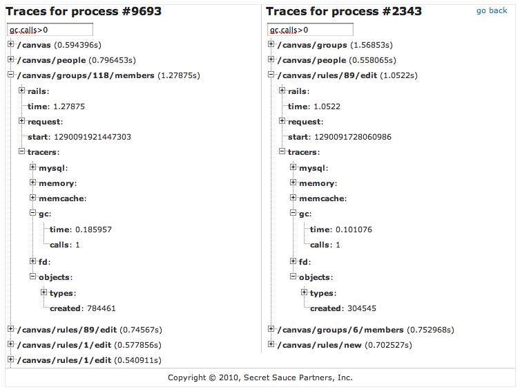

!SLIDE 
# [Memprof](https://github.com/ice799/memprof)

## A Ruby gem for memory profiling
## Good for much more than I'm going to show you. Check it out!

### Memprof only supports 1.8.x (MRI and REE) VMs, and only if they are 64-bit and contain debugging symbols

!SLIDE
# Memprof.trace

    @@@ ruby
    require 'open-uri'
    require 'mysql'
    require 'memcached'

    Memprof.trace {
      10.times { Module.new }
      10.times { GC.start }
      10.times { open('http://google.com/') }
      10.times { Mysql.connect.query("select 1+2") }
      10.times { Memcached.new.get('memprof') }
    }

!SLIDE

    @@@ javascript
    {
      "objects": {
        "created": 10,
        "types": {
          "module": 10,  # Module.new
        }
      },
      "gc": {
        "calls": 10,     # GC.start
        "time": 0.17198
      },
      "fd": {
        "connect": {
          "calls": 10,   # open('http://google.com')
          "time": 0.0110
        }
      },
      "mysql": {
        "queries": 10,   # Mysql.connect.query("select 1+2")
        "time": 0.0006
      },
      "memcache": {
        "get": {
          "calls": 10,   # Memcached.new.get('memprof')
          "responses": {
            "notfound": 10
          }
        }
      }
    }

!SLIDE
# Supports Rack requests too

    @@@ ruby
    Memprof.trace_request(env){ @app.call(env) }

!SLIDE

    @@@ javascript
    {
      "start" : 1272424769750716,
      "tracers" : {
        /* ... */
      },
      "rails" : {
        "controller" : "home",
        "action" : "index"
      },
      "request" : {
        "REQUEST_URI" : "/home",
        "REQUEST_METHOD" : "GET",
        "REMOTE_ADDR" : "127.0.0.1",
        "QUERY_STRING" : null
      },
      "time" : 1.3442
    }

!SLIDE
# And the Silver Bullet

    @@@ ruby
    require 'memprof/tracer'
    Rails.configuration.middleware.use(Memprof::Tracer)
    # saves traces to /tmp/memprof_tracer-PID.json

!SLIDE center smbullets smaller
# DEMO of memprof traces browser

* Code available at: [gist.github.com/705063](https://gist.github.com/705063)
